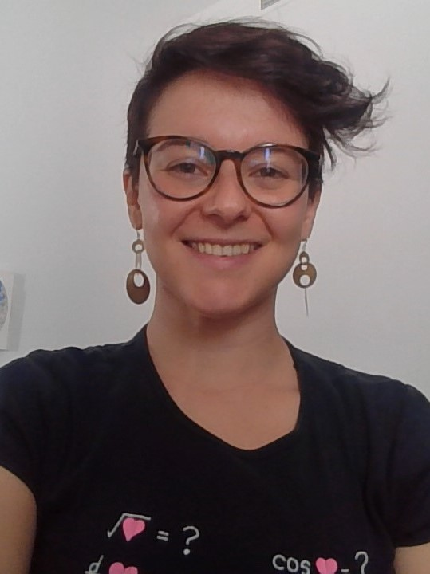
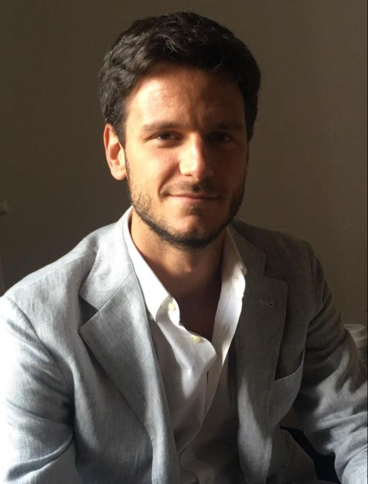

## Details
{: style="float: left;  margin-right: 1em;" height="20%" width="20%"} The aim of the annual Australian Algebra Conference is to foster communication between algebraists in Australia. We interpret algebra broadly, including areas such as topological algebra, algebraic logic, graph theory and coding theory. The conference is run by the [Australian Algebra Group](https://sites.google.com/a/ltumathstats.com/austalg/about-us), which is a special interest group of the [Australian Mathematical Society](https://austms.org.au/).

- **Dates**: Wednesday November 17 - Friday November 19, 2021. 
- **Times**: 12:00 PM - 5:00 PM Perth time (should be  -  your time).
- **Venue**: Online, hosted by the [Centre for the Mathematics of Symmetry and Computation](https://www.cmsc.io/), [the University of Western Australia](www.uwa.edu.au/).

See below for more information. 
{: height="100%" width="100%"}

## Registration
Registration is free.

- **Registration closes**: 16th of November, 2021
- **Abstract and contributed talk submission**: 3rd of November, 2021

If you wish to give a contributed talk, please send your title and abstract to [5th.Australian.Algebra.Conference@gmail.com](mailto:5th.Australian.Algebra.Conference@gmail.com) by the 3rd of November. Contributed talks will be 20 minutes plus questions. Please use simple LaTeX format (avoiding macros - think arXiv abstract format).

**Note, you do not need to have your title/abstract ready in order to register.** If we do not receive an abstract by the 3rd of November, we will simply assume that you have decided not to give a talk - don't let this hold you back!

- **To register, please fill in [this form](https://docs.google.com/forms/d/e/1FAIpQLSf_hwzoE3pEZTgJG2SXZ1RqtzguACgpOL2jfu5ESBEh25oe6g/viewform?usp=sf_link).**

Registration form not working? click here.

If the registration link is blocked from you location, you can register by emailing us directly at 5th.Australian.Algebra.Conference@gmail.com with the following information: first name / last name / affiliation / are you giving a contributed talk? / are you eligible for the Gordon Preston Prize (student talk)?

## Invited speakers

|  |  |  |
|:--:|:--:|:--:|
[Alejandra Garrido](https://verso.mat.uam.es/~alejandra.garrido/), Universidad Autónoma de Madrid, Spain. | [Eugenio Giannelli](https://eugeniomaths.wordpress.com/), Università degli Studi di Firenze, Italy. |[Melissa Lee](https://melissamaths.wordpress.com/), University of Auckland, New Zealand. |

## Gordon Preston Prize

The [Gordon Preston Prize](https://sites.google.com/a/ltumathstats.com/austalg/gordon-preston-prize) is awarded for the best presentation at the AAC given by a current student based at an Australian or overseas university. The presentations will be judged by a panel appointed by the executive committee. The winner of the prize will receive $300. [The Rules](https://sites.google.com/a/ltumathstats.com/austalg/rules-for-the-gordon-preston-prize) for the Gordon Preston Prize are available on the website of the Australian Algebra Group. 

## Conference booklet

The conference booklet will be available once registrations have been finalised.

## Timetable
The timetable will be available once registrations have been finalised.

Note: Official times are given in Perth time. Local time is intended to be helpful, but it is up to you to check it is correct.

#### Wednesday 17th

| Time | Stream A | Stream B | 
|:--:|:--:|:--:|
| 11:50 AM - 12:00 PM ( locally  to  ) | **Conference Welcome** | **---** |
| 12:00 PM - 12:20 PM ( locally  to  ) |  |  |
| 12:30 PM - 12:50 PM ( locally  to  ) |  |  |
| 1:00 PM - 1:20 PM ( locally  to  ) |  |  |
| 1:30 PM - 2:00 PM ( locally  to  ) | **break** | **break**  |
| 2:00 PM - 2:20 PM ( locally  to  ) |  |  |
| 2:30 PM - 2:50 PM ( locally  to  ) |  |  |
| 3:00 PM - 3:20 PM ( locally  to  ) |  |  |
| 3:30 PM - 4:00 PM ( locally  to  ) | **break** | **break** |
| 4:00 PM - 4:45 PM ( locally  to  ) | **Alejandra Garrido, TBA** | **---** |

#### Thursday 18th

| Time | Stream A | Stream B | 
|:--:|:--:|:--:|
| 12:00 PM - 12:20 PM ( locally  to  ) |  |  |
| 12:30 PM - 12:50 PM ( locally  to  ) |  |  |
| 1:00 PM - 1:20 PM ( locally  to  ) |  |  |
| 1:30 PM - 2:00 PM ( locally  to  ) | **break** | **break**  |
| 2:00 PM - 2:20 PM ( locally  to  ) |  |  |
| 2:30 PM - 2:50 PM ( locally  to  ) |  |  |
| 3:00 PM - 3:20 PM ( locally  to  ) |  |  |
| 3:30 PM - 4:00 PM ( locally  to  ) | **break** | **break** |
| 4:00 PM - 4:45 PM ( locally  to  ) | **Eugenio Giannelli, "On Sylow Branching Coefficients"** | **---** |

#### Friday 19th

| Time | Stream A | Stream B | 
|:--:|:--:|:--:|
| 12:00 PM - 12:45 PM ( locally  to  ) | **Melissa Lee, "An algebraic tasting platter"** | **---** |
| 1:00 PM - 1:20 PM ( locally  to  ) | **Presentation of Gordon Preston Prize & conference "photo"** | **---** |
| 1:30 PM - 2:00 PM ( locally  to  ) | **break** | **break**  |
| 2:00 PM - 2:20 PM ( locally  to  ) |  |  |
| 2:30 PM - 2:50 PM ( locally  to  ) |  |  |
| 3:00 PM - 3:20 PM ( locally  to  ) |  |  |
| 3:30 PM - 4:00 PM ( locally  to  ) | **break** | **break** |
| 4:00 PM - 4:20 PM ( locally  to  ) |  |  |
| 4:30 PM - 4:50 PM ( locally  to  ) |  |  |

## Participants

The list of participants will be updated as registrations come in.

- Ramon Abud Alcala, Macquarie University
- Jack Allsop, Monash University
- Ibrahim  Alotaibi, USYD
- Iin  Ariyanti, University of Muhammadiyah Banjarmasin
- Ali  Asiri, Finders University
- John Bamberg, The University of Western Australia
- Santiago Barrera Acevedo, Monash University
- Alex Bishop, University of Sydney
- Jim Byrnes, Prometheus Inc.
- Max Carter, The University of Newcastle
- Su Yuan Chan, Deakin University
- Lei Chen, The University of Western Australia
- Andrew Craig, University of Johannesburg
- John Cu, University of Technology Sydney
- Brian Davey, La Trobe University
- Alex de Lacy, Monash University
- Heiko Dietrich, Monash University
- Dung Duong, University of Wollongong
- James East, Western Sydney University
- Murray Elder, University of Technology Sydney
- Evelyn Gabinete, The University of Sydney
- Richard Garner, Macquarie University
- Alejandra Garrido, Universidad Autónoma de Madrid
- Eugenio Giannelli, Università degli Studi di Firenze
- Michael Giudici, The University of Western Australia
- Stephen Glasby, University of Western Australia
- Miroslav Haviar, Matej Bel University
- Daniel Hawtin, University of Rijeka
- Roozbeh Hazrat, Western Sydney University
- Edmund Heng, Australian National University
- Tamara Hogan, University of Melbourne 
- Deborah Jackson, La Trobe University
- Marcel Jackson, La Trobe University
- Jesse Lansdown, The University of Western Australia
- Mihai-Silviu Lazorec, Faculty of Mathematics, "Alexandru Ioan Cuza" University of Iasi, Romania
- Melissa Lee, University of Auckland
- Florian Lehner, Graz University of Technology
- Kevin Limanta, UNSW Sydney
- Pankaj Manjhi, Vinoba Bhave University, Hazaribag
- Pankaj Kumar  Manjhi, University Department of Mathematics, Vinoba Bhave University Hazaribag, India. 
- Luke Mathieson, University of Technology Sydney
- Kerri Morgan, Deakin University
- Kie Seng Nge, Australian National University
- Bregje Pauwels, The University of Sydney
- Adam Piggott, Australian National University
- Tomasz Popiel, University of Auckland
- John Power, Macquarie University
- Cheryl Praeger, The University of Western Australia
- Youming Qiao, University of Technology Sydney
- MAHENDRA  RANA, UNIVERSITY DEPARTMENT OF MATHEMATICS, VINOBA BHAVE UNIVERSITY, HAZARIBAG, INDIA
- Gordon Royle, University of Western Australia
- Phill Schultz, UWA
- Tim Stokes, University of Waikato
- Darryl Teo, University of Western Australia
- Lauren Thornton, University of the Sunshine Coast
- Kane Townsend, The University of Sydney
- Ilknur Tulunay, UNSW
- Ivo Vekemans, The Australian National University
- Giada Volpato, Università degli Studi di Firenze
- Ian Wanless, Monash University
- Muhammad Siddiq Wira Awaldy, Bandung Institute of Technology
- Willie Wong, National Institute of Education of Singapore
- Kai Siong Yow, Universiti Putra Malaysia
- Shasha Zheng, The University of Melbourne
  
## Talk slides and recordings
The current default is that talks will be recorded. If you do not want your talk to be recorded, please let us know. In any case, no recordings will be made available without the explicit consent of the speaker.

## Organisers
- [John Bamberg](https://johnbamberg.github.io/), the University of Western Australia
- [Jesse Lansdown](https://www.jesselansdown.com/), the University of Western Australia
- [Michael Giudici](https://research-repository.uwa.edu.au/en/persons/michael-giudici), the University of Western Australia
- [Stephen Glasby](https://stephenglasby.github.io/), the University of Western Australia
- [Cheryl Praeger](https://research-repository.uwa.edu.au/en/persons/cheryl-praeger), the University of Western Australia
