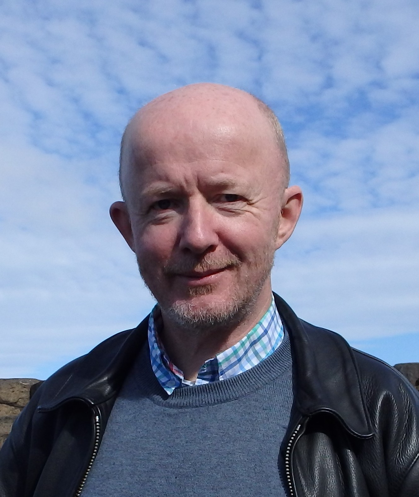
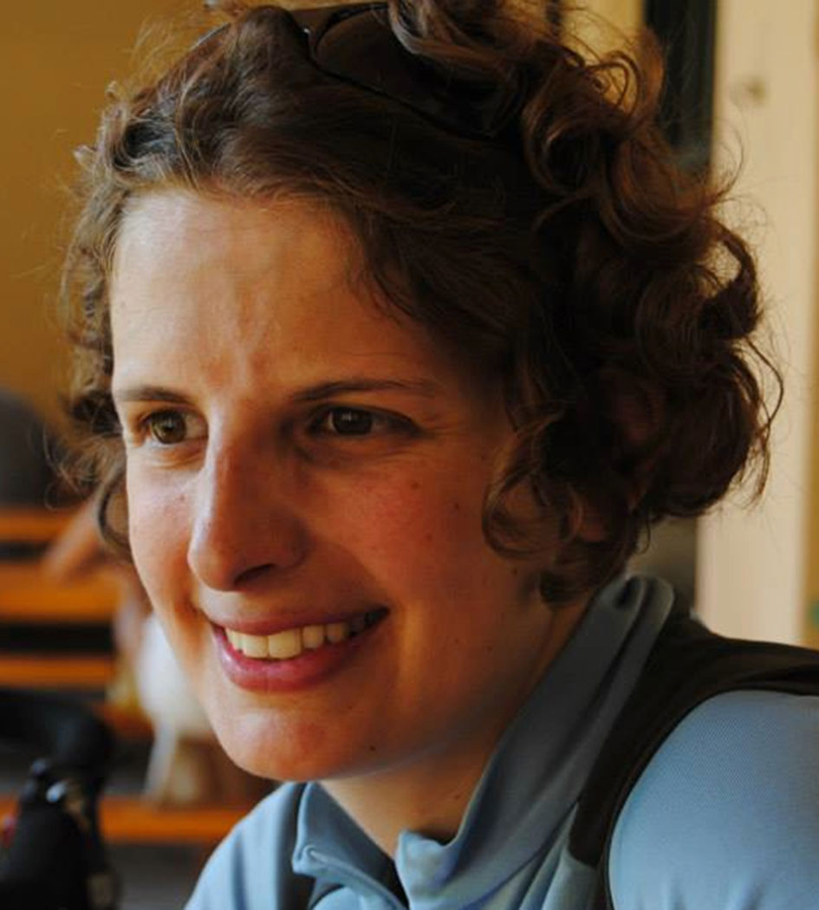

We welcome you to the **7th Australian Algebra Conference**, to be held at **Monash University** (Clayton Campus in Melbourne), from **November 22-24, 2023**.

The main aim of the annual Australian Algebra Conference is to foster communication between algebraists in Australia. We interpret algebra quite broadly, including areas such as topological algebra, algebraic logic, graph theory and coding theory. The conference is run by the [Australian Algebra Group](https://sites.google.com/a/ltumathstats.com/austalg/about-us), which is a special interest group of the [Australian Mathematical Society](https://austms.org.au/).

The conference has a proud tradition of encouraging talks by students: typically about one third of the talks are presented by students. The conference aims to provide graduate students in algebra with the opportunity to give their first public presentation in a relaxed and supportive environment. Each conference, the most outstanding student talk is awarded the [Gordon Preston Prize](https://sites.google.com/a/ltumathstats.com/austalg/gordon-preston-prize).

<a href="#section-2">Jump to section 2</a> 

## Invited speakers

|  |  |  |
|:--:|:--:|:--:|
[Eamonn O'Brien](https://www.math.auckland.ac.nz/~obrien/), University of Auckland, New Zealand. | [Colva Roney-Dougal](https://www.st-andrews.ac.uk/mathematics-statistics/people/cmr1/), University of St. Andrews, UK. |[Geertrui Van de Voorde](https://www.canterbury.ac.nz/engineering/contact-us/people/geertrui-van-de-voorde.html)), University of Canterbury, New Zealand. |

## Registration
Please see below for the schedule of conference registration fees.

**Students:** $0

**Members of the Australian Algebra Group:** $0

**Members of AustMS who are not members of AAG:** $30

**Non-members of AustMS:** $40

The registration fee will cover morning and afternoon tea, as well as a barbecue lunch on one of the days of the conference.

We will also have an individually funded conference dinner.

There is limited travel support available for students. If you would like to apply for this support, please email [Santiago Barrera Acevedo](mailto:santiago.barrera.acevedo@monash.edu?subject=Student%20funding%20application%20for%20AAC) with a letter of support from your supervisor and an approximate budget of your expenses.

The allocation of funding will be communicated to applicants before registration closes.

## Deadlines

**Travel support applications due:** 29th September 2023

**Registration closes:** 3rd November 2023

**Abstract deadline:** 3rd November 2023

## Talks 

If you wish to give a contributed talk, please send your title and abstract to [Santiago Barrera Acevedo](mailto:santiago.barrera.acevedo@monash.edu?subject=Student%20funding%20application%20for%20AAC) by the 3rd of November. Contributed talks will be 20 minutes plus questions. Please use simple LaTeX format (avoiding macros - think arXiv abstract format).

**Note, you do not need to have your title/abstract ready in order to register.** If we do not receive an abstract by the 3rd of November, we will simply assume that you have decided not to give a talk - don't let this hold you back!

- **To register, please fill in [this form](https://forms.gle/HifdrEdRzJRnovBd6).**

## Gordon Preston Prize

The [Gordon Preston Prize](https://sites.google.com/a/ltumathstats.com/austalg/gordon-preston-prize) is awarded for the best presentation at the AAC given by a current student based at an Australian or overseas university. The presentations will be judged by a panel appointed by the executive committee. The winner of the prize will receive $300. [The Rules](https://sites.google.com/a/ltumathstats.com/austalg/rules-for-the-gordon-preston-prize) for the Gordon Preston Prize are available on the website of the Australian Algebra Group. 

## Local Information
The conference will be held at the Clayton campus of Monash University in Melbourne.

All talks will be held in Lecture Theatre South 1 (43 Rainforest Walk), close to the bus loop: please see the Clayton Campus Map for details (a static version of the map is available here).

The Clayton campus is located about 25km south-east of the Melbourne CBD.

Here are some suggestions for accommodation close to Monash Clayton campus:

Clayton Serviced Apartments
Quest Notting Hill Serviced Apartments
Gateway on Monash Hotel
ParkRoyal Monash Hotel 

If choosing to stay in the city instead, participants can reach the campus fairly easily by taking the Pakenham/Cranbourne train to Huntingdale, and then taking the 601 shuttle bus. This journey takes around 30-45min and both legs run regularly.

<h2 id="section-2">Section 2</h2>

## Organisers
- [Santiago Barrera Acevedo](https://users.monash.edu/~sacevedo/), Monash Unversity
- [Heiko Dietrich](https://users.monash.edu/~heikod/), Monash Unversity
- [Melissa Lee](https://melissamaths.wordpress.com/), Monash Unversity
- [Tomasz Popiel](https://tomasz-popiel.github.io/index.html), Monash Unversity

